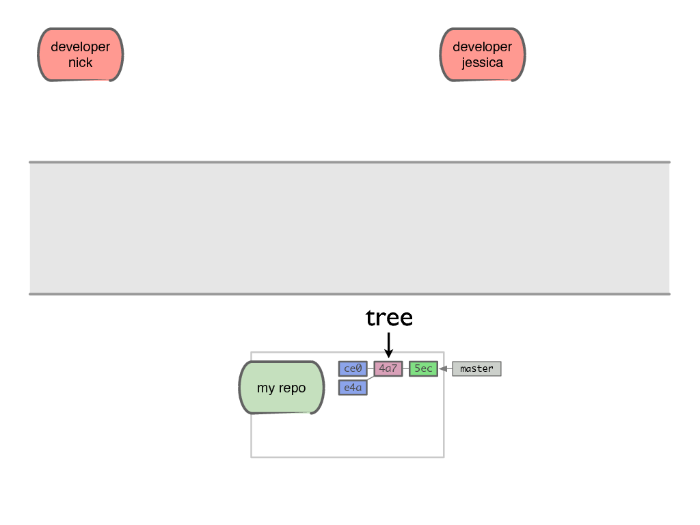
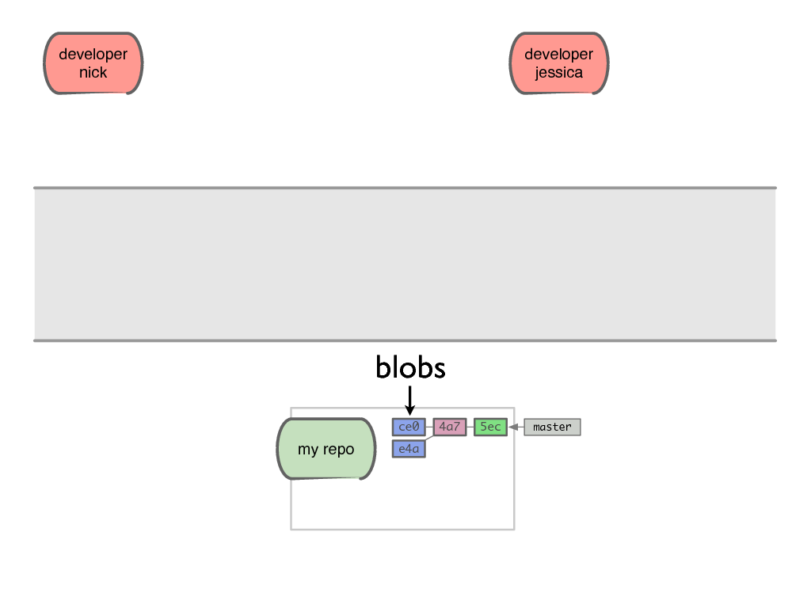
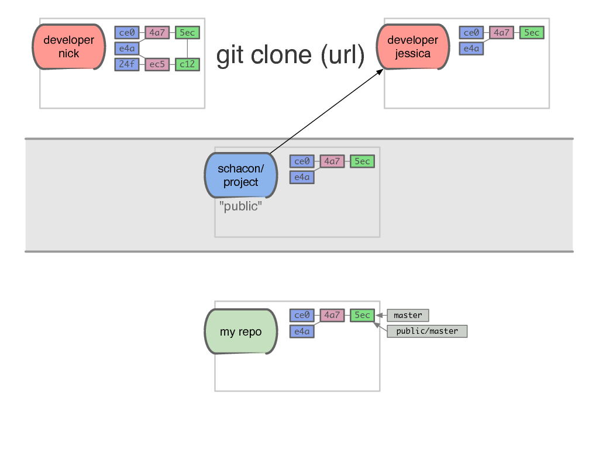
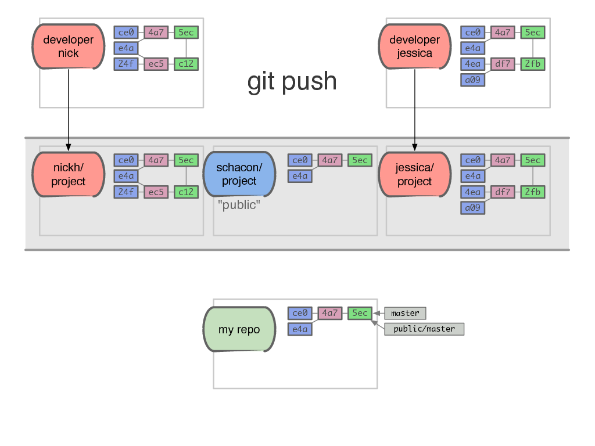
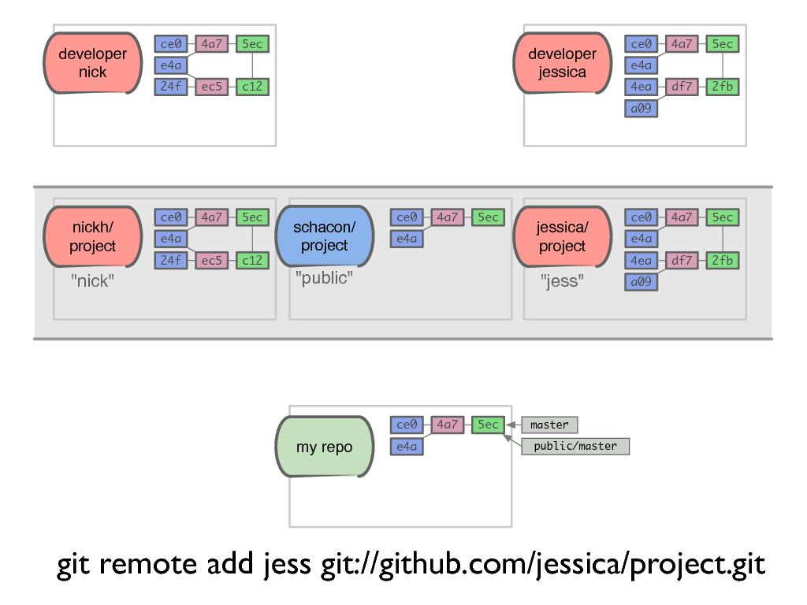
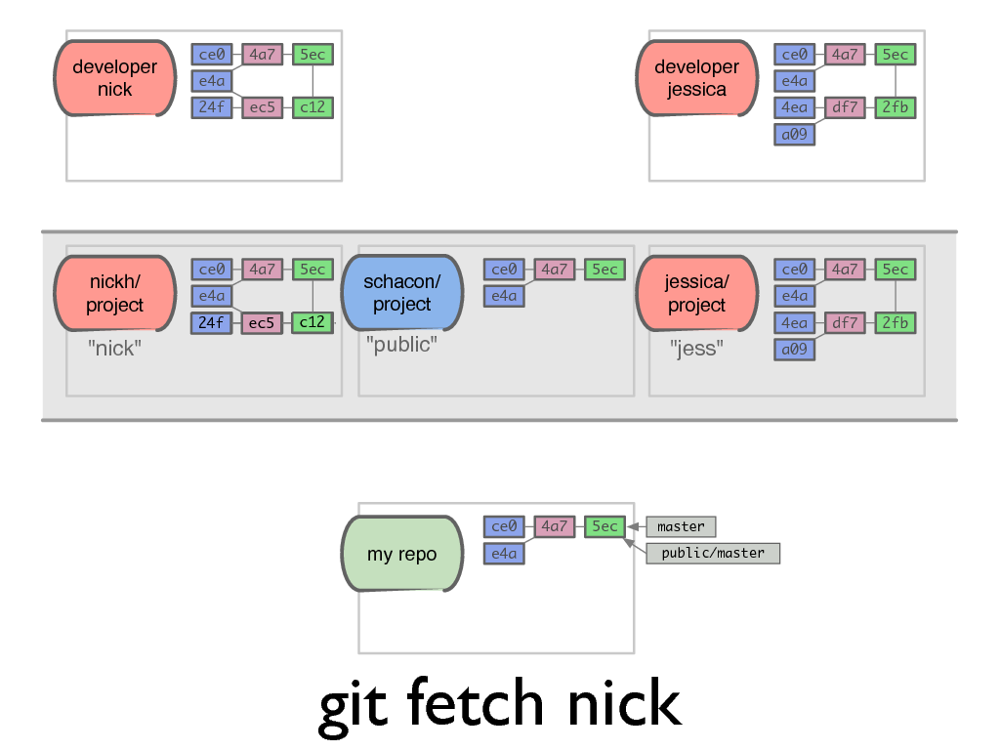
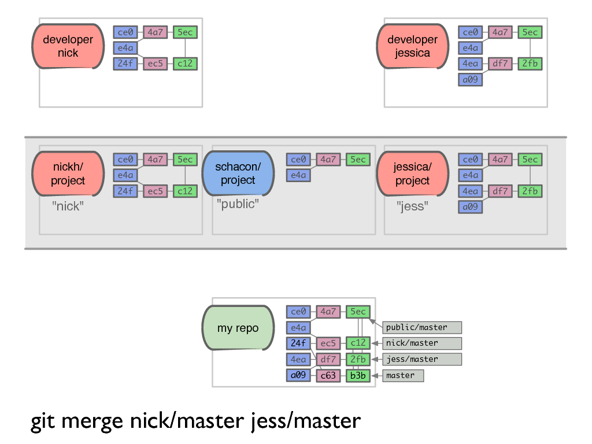
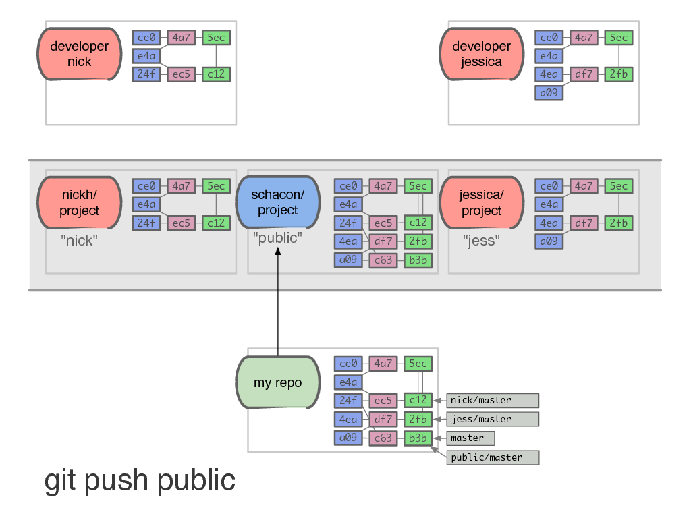

!SLIDE subsection

# Collaboration

!SLIDE

# Git est une base d&#39;objet **synchronisable**

!SLIDE

# 2 manières de collaborer

!SLIDE

# La méthode
# «chacun chez soi»
### (mode par défaut)

!SLIDE

# Je récupére du code

!SLIDE

# J&#39;annonce que mes modifications sont disponible

!SLIDE

# Votre dépôt est **personnel**

!SLIDE center

!SLIDE center

!SLIDE center

!SLIDE center

!SLIDE center

!SLIDE center

!SLIDE center

!SLIDE center

!SLIDE center

!SLIDE center

!SLIDE center

!SLIDE

# La méthode
# «1 pour tous, tous pour 1»

!SLIDE commandline

## Dépôt partagé (bare)

	$ git clone --bare -s sharedrepo.git

!SLIDE bullets

## Différence entre dépôt «classique» et «bare» :
* bare : pas de working dir
* bare : .git à la fin (convention)

!SLIDE

# Par défaut, historique non modifiable

!SLIDE

# Tout est dans le **refspec**

!SLIDE

# Exemple de refspec générique :

    [remote "origin"]
    fetch = +refs/heads/*:refs/remotes/origin/*
    url = ssh://server/path/to/repo

    [branch "master"]
    remote = origin
    merge = refs/heads/master

!SLIDE

## Tout ce qui est sur origin prend un espace de nom origin.
### master -> origin/master
### test   -> origin/test

!SLIDE

## La branche distante master est liée avec ma branche master.
### master <-> origin/master

!SLIDE

# pull = fetch + merge

!SLIDE commandline

# Le refspec se donne aussi en ligne de commande

    $ git fetch origin +pu:tmp                                                                          
    $ git push HEAD:master                                                                              
    $ git push origin master:refs/heads/qa/experimental 
    $ git push :toto

!SLIDE

# La notion de «remote»

!SLIDE center

!SLIDE center

!SLIDE center

!SLIDE center

!SLIDE center

!SLIDE center

!SLIDE center

!SLIDE center

!SLIDE center

!SLIDE center

!SLIDE center

!SLIDE center

!SLIDE center

!SLIDE center

!SLIDE center

!SLIDE center

!SLIDE center

!SLIDE center

!SLIDE center

!SLIDE center

!SLIDE center

!SLIDE center

!SLIDE center

!SLIDE center

!SLIDE

# Les «remotes» sont des branches

!SLIDE center

!SLIDE center

!SLIDE center

!SLIDE center

!SLIDE center

!SLIDE center

!SLIDE center

!SLIDE center

!SLIDE center

!SLIDE center

!SLIDE center

!SLIDE center

!SLIDE center

!SLIDE center

!SLIDE center

