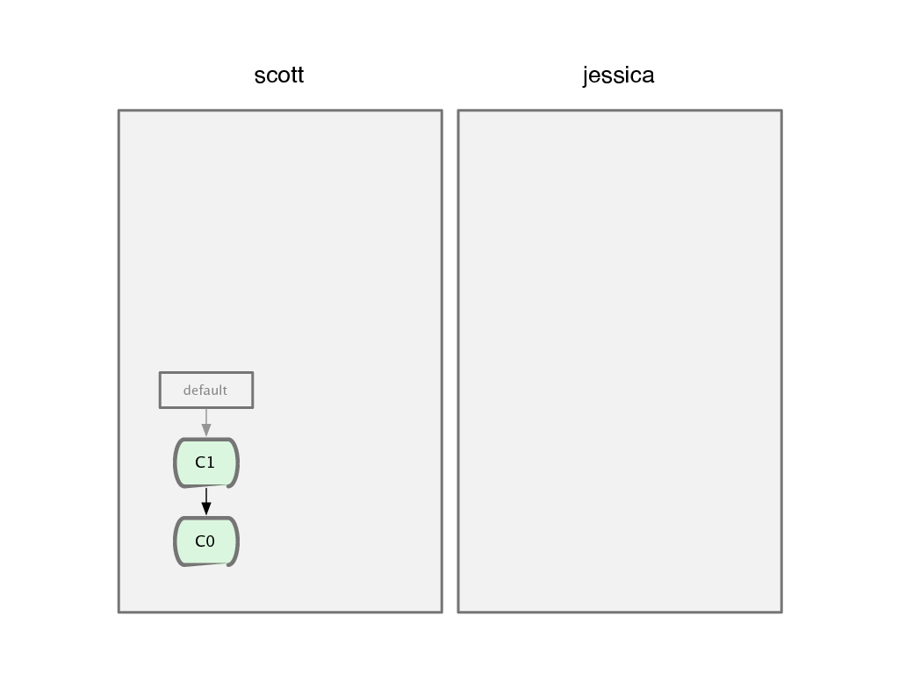
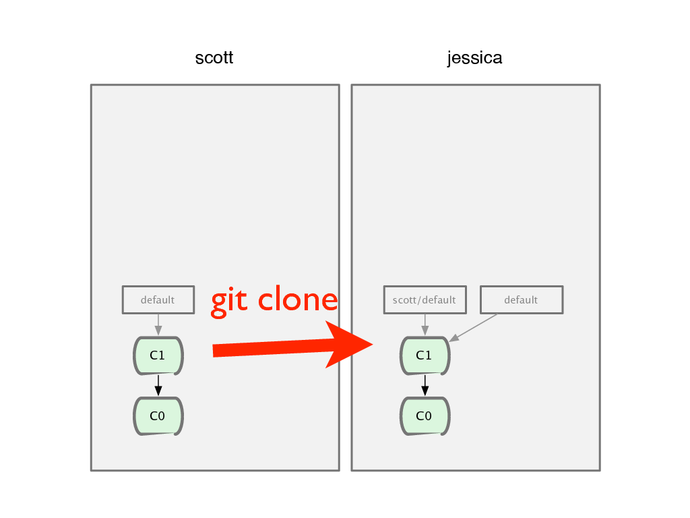
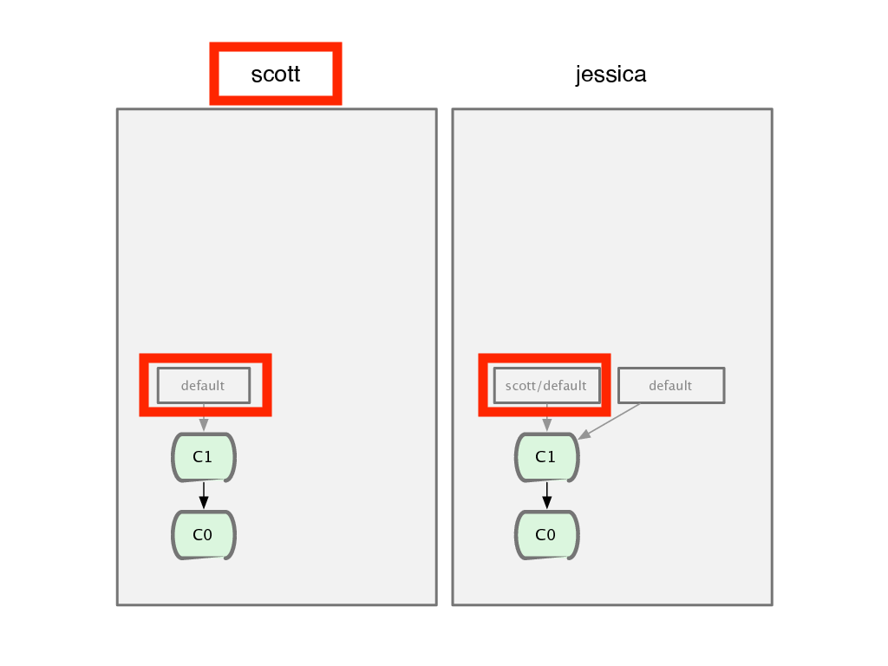

!SLIDE subsection

# Collaboration

!SLIDE

# Git est une base d&#39;objet synchronisable

!SLIDE

# 2 manières de collaborer

!SLIDE

# La méthode
# «chacun chez soi»
### (mode par défaut)

!SLIDE

# Je récupére du code

!SLIDE

# J&#39;annonce que mes modifications sont disponibles

!SLIDE

# Votre dépôt est personnel

!SLIDE center

!SLIDE center

!SLIDE center

!SLIDE center

!SLIDE center

!SLIDE center

!SLIDE center

!SLIDE center

!SLIDE center

!SLIDE center

!SLIDE center

!SLIDE

# La méthode
# «1 pour tous, tous pour 1»

!SLIDE commandline

## Dépôt partagé (bare)

	$ git clone --bare -s sharedrepo.git

!SLIDE bullets

## Différence entre dépôt «classique» et «bare» :
* bare : pas de working dir
* bare : .git à la fin (convention)
