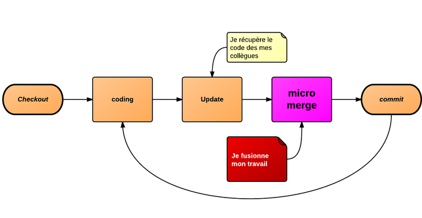

!SLIDE

# Question</question>
## Cela vous est il arrivé ?

!SLIDE

# D&#39;ou venait le problème ?

!SLIDE center

!SLIDE center

!SLIDE

# Quelle est la raison ?

!SLIDE

# Plus c&#39;est gros, plus c&#39;est **difficile** de merger

!SLIDE

# D&#39;ou les commits **fréquents**

!SLIDE bullets

# Conséquence, du code...

* non testé
* non fini
* non validé
* non documenté 

!SLIDE

# **Micro Merge** permanent 

!SLIDE center

!SLIDE center

!SLIDE

# Pour conséquence

!SLIDE center

!SLIDE

# Et les branches SVN ?

!SLIDE center

!SLIDE center

!SLIDE center

!SLIDE

# Question</question>
## Qui aime merger des branches SVN ?

!SLIDE

# SVN **traumatise**
## On est arrivé à dire que les branches causent toujours des problèmes

!SLIDE

# Pourquoi ?

!SLIDE 

# Il est trés facile de faire des branches...

!SLIDE

# Mais c&#39;est un **cauchemar** pour merger

!SLIDE center

## Houston nous avons un problème !

!SLIDE

# Nous utilisons un outil de gestion de source...

!SLIDE

# ...mais sans les fonctionnalités associées

!SLIDE

# C&#39;est un gestionnaire d&#39;historique (copie évoluée)

!SLIDE center

!SLIDE

# Objectif à atteindre :
## Livrer **régulièrement** de la valeur
### (si possible en étant toujours stable)

!SLIDE bullets

# Ce qui signifie **connaitre** l&#39;état du projet
### (idéalement supprimer le passage dev -> livraison)

!SLIDE

# Le moyen clé :
# **isolation**
